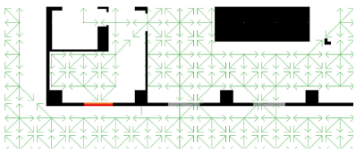
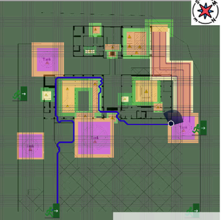

# Risk Aware Navigation

Demo of Risk-aware navigation system tailored for industries with a focus on accident prevention and insurance coverage

### Apps
- Component [inventory creator](#inv) module
    - /inventory
- [Risk calculation module](#str)
    - /src
- Risk-based navigation module, variation of [A* pathfinding algorithm](#astar)
    - /navigation

### Environmental variables
- MONGO_INITDB_ROOT_USERNAME
    - MongoDB username
- MONGO_INITDB_ROOT_PASSWORD
    - MongoDB password
- DATABASE_NAME
    - MongoDB database name
- NAVIGATION_IP_ADDRESS
    - IP address or container name of navigation app
- NAVIGATION_PORT
    - navigation app's port
- MAP_NAME
    - map name, currently "map_a", "map_b" to distinguish for a generated fictitious map, and a real map, respectively
- REDIS_HOST
    - redis server hostname
- REDIS_PORT
    - redis server port
- DB_TYPE
    - Database type, "remote" (cloud) or "local"

**Risk-aware-navigation:**
1. [Component inventory app](#inv)
2. [Component inventory database in NoSQL](#db)
3. [Structural risk calculation module](#str)
4. [Structural and environmental risk integration module](#combo)
5. [Patch request to risk mapping API for risks](#request)
6. [The Modified A* Algorithm](#astar)

**Required libraries**: 

        python -m pip install -r requirements.txt
        pip install "pymongo[srv]"

### 1. Map creator API

Show/Hide

 

Component inventory creation app. Uses **Express.js** and **MongoDb** to generate component inventory and place them on the selected map. 

**To start the application, run the following command in your terminal:**

      cd inventory
      npm install
      node index.js

**Viewing API Documentation**

      localhost:{{PORT}}/api-docs

Replace {{PORT}} with the port number your application is running on.

### 2. Component inventory database in NoSQL

Show/Hide

 

**Structure of the component inventory database created via Mongo**

  

* Note: **bold** stands for required arguments, red stands for unique arguments. 

#### Definitions

* components - primary document consisting of all components
        
      _id - unique identifier
      name - name of the component
      description - description of the component
      reference - reference to the component (e.g., existing literature)
      cells - cell IDs of the map that include the component
      influence_cells - cell IDs of the map that include the influence zone of the component

* fragilityFunctions - description of the fragility function of the component

      _id - unique identifier
      imName - intensity measure name (e.g., PGA)
      unitOfMeasure - unit of measure of the intensity measure (e.g., g as in gravity acceleration or 9.81 m/s2)
      component - component identifier to which the function is tied to

* damageStates - description of the damage states characterising the component  - List of damage states
  
      _id - unique identifier
      name - name of the damage state (e.g., DS1)
      mean - mean of the distribution, must be in the same units as the fragilityFunctions
      dispersion - dispersion of the distribution
      component - component identifier to which the damage state is tied to

* coordinates - coordinates of the component within the map in cm - List of coordinates - may have multiple locations

      _id - unique identifier
      topLeft - top left coordinates in cm
      topRight - top right coordinates in cm
      bottomLeft - bottom left coordinates in cm
      bottomRight - bottom right coordinates in cm
      influenceRadius - influence radius of the component in cm, default to 0.0 cm
      component - component identifier to which the coordiantes are applied to

### 3. Risk calculation module

Show/Hide

 

**To start the application, run the following command in your terminal:**

      uvicorn src.app:app --port {{PORT}} --reload

**Takes as input:**
1. IM value - intensity measure value as float
2. Json filename - map of the plant as Path
    
      GET request to the API for the map with the name

**Runs**
3. assign_cells

      GET request to component directory
      Loop over each component and its coordinates
      Based on map information and coordinates calculate cell ID
      PATCH request to update the cell IDs
      
4. compute_risks

      GET request to component inventory for each component's fragility function and damage states
      Compute risk based on damage state and intensity measure
      Create a list of risks of the size of the number of cells
   

### 4. Structural and environmental risk integration module

Show/Hide

 

**Runs**

1. Receive call from Environmental RIE
2. Combine with Structural RIE

### 5. Patch request to risk mapping API

Show/Hide

 

1. update_risks_rossini 
   
        Make PUT request to risk mapping api to update risks
        curl -X PUT id_address:port/map -H "Content-Type: application/json" -d 
        '{"personal_protection_equipment":"helmet",
        "map":[{"floor":0,"risk_values":[0,50,100]},{"floor":1,"risk_values":[2,3,4,5]}]}'
        

### 6. The Modified A* Algorithm

Show/Hide

 

Risk-aware route is computed based on the client's starting position from two data structures: the **risk-map** and the **routes-graph** (directed graph representing all the walkable paths). 

The map (grid) area is modelled into discrete cells which consider the physical characteristics of the environment, like the walls and the emergency exits. The map is a .json file with cell information in terms of its connectivity to other cells, with identifications from left to right and up to bottom approach. Two cells are connected if there is no wall between them. The red door is one-way.

When the risk map is received from Risk Calculation module, the weight of the nodes in the routes-graph are updated. High risk transfers to high weight. An **adaptation of the A* algorithm** is used, where the best route is computed from the current user's position to each safe area and the best route among them is selected.

**Best route** is defiend as the route that minimises the maximum risk value encountered, different from typical A*, where the aim is to minimise the sum of the risk along the route. For example, if route A has a risk of 9 but all 1's, while route B has all 4's, the best route will be the route B, since we don't want the user to pass through a very dangerous (risk 9) area. Additionally, no importance is given to metric distance for the scope. Only, maximum risk is the metric for identifying the best route. Multiple safe zones (target cells) are supported.

*Since this is a demo version, the software does not include all the aspects necessary for it to run on a mobile app*

For more detail refer to:

O’Reilly, G. J., D. Shahnazaryan, P. Dubini, E. Brunesi, A. Rosti, F. Dacarro, A. Gotti, D. Silvestri, S. Mascetti, M. Ducci, M. Ciucci, and A. Marino. 2023. **“Risk-aware navigation in industrial plants at risk of NaTech accidents**.” Int. *J. Disaster Risk Reduct.*, 88: 103620. https://doi.org/10.1016/j.ijdrr.2023.103620.

### Grid
Available sample files in **maps/**

    {
        'rows': int,
        'columns': int,
        'safe_zones': List[int],
        'cells': List[
            {
                'id': int,
                'connections': List[int],
            },
            {}, ...
        ]

        'scene_name': Optional[str],
        'map_name': Optional[str],
        'orientation_respect_north_0_360_degrees': Optional[float],
        'millimeter_per_pixel': Optional[float],
        'cell_size_cm': Optional[float],
        'cell_size_pixel': Optional[float],
    }

- rows = number of rows in a grid
- columns = number of columns in a grid
- safe_zones = IDs of destination cells
- cells - all cells
- id - unique identifier of a cell (ID), starts from 0
    - sequential from left to right, top to bottom
- connections - successor cell IDs of a cell with 'id'

### Step-by-step
Within the scope of this work, 'f' stands for 'risk'.

1. Initialize a risk array of zeros with length of number of grid cells
    a. The risk array is ideally constantly monitored for any live changes from sensors and risk (RIE) module, which is not implemented in the current demo (part of it available through src/)
2. Initialize OPEN list containing the the starting node only
    a. set node RISK to 0 irrelevant of actual risk
3. Initialize empty CLOSED list
4. While OPEN list is not empty
    a. find node with lowest RISK on the OPEN list (node i)
        i. If the node is in our destination, then **path is found**, return
    b. pop found node i from list and generate all its available successor's and set their parents to node i ('connections')
    c. put node i into the CLOSED list
    d. for each successor
        i. get the RISK value
        ii. if a node with the same position as the successor is in the OPEN, which has lower RISK than the successor, skip this successor
        iii. If a node with the same position as the successor is in the CLOSED, which has a lower RISK than the successor, skip this successor
        iv. Otherwise, add the node to the OPEN

